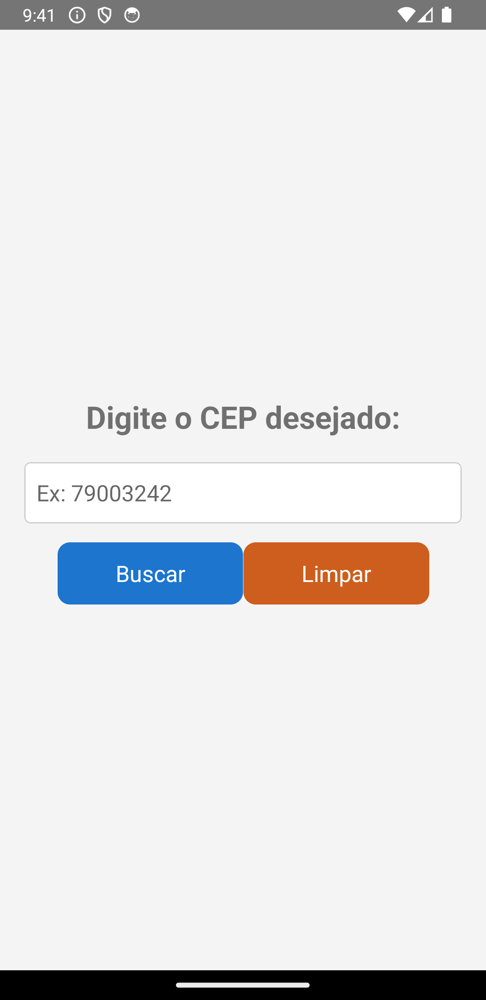
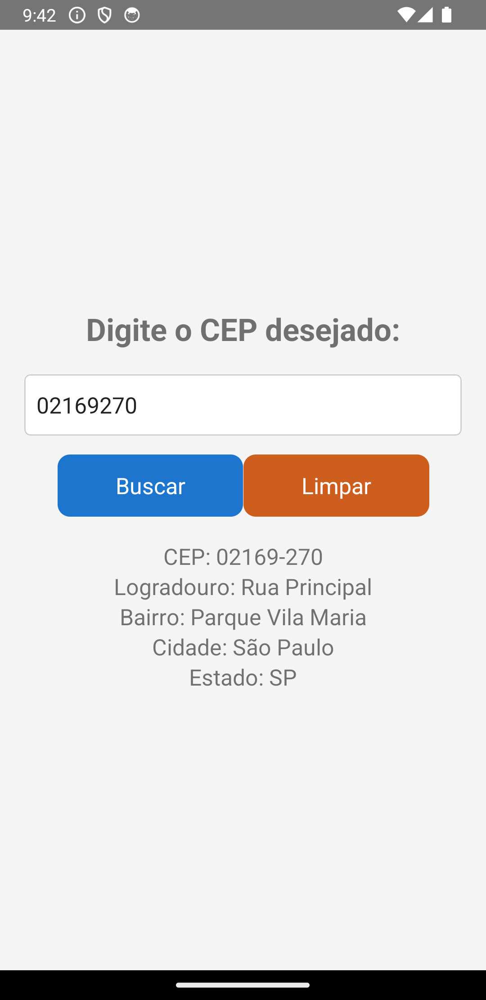
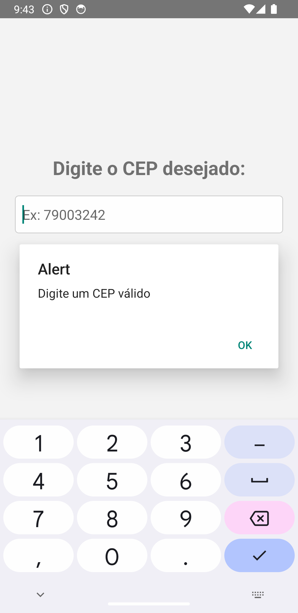

# CEP Search App

## Purpose

- The CEP Search App is a mobile application built with React Native. Its primary purpose is to provide users with the ability to search for location information based on Brazilian postal codes (CEPs). When a valid CEP is entered, the app displays details about the corresponding location, including the postal code, street name, neighborhood, city, and state.

Additionally, the app ensures that users provide a valid CEP and displays an alert if an empty or invalid CEP is entered. This app is designed to offer users a convenient way to retrieve location data quickly and accurately.

## Features

- Enter a Brazilian postal code (CEP) to search for location details.
- Displays information such as postal code, street name, neighborhood, city, and state.
- Provides a clear button to reset the input and results.
- Alerts the user to input a valid CEP if none is provided.

## Cep-Search-App Preview

### Screenshot:

  
  <br>
  <br>
  
  <br>
  <br>
  
  <br>

## Technologies Used

- React Native
- CLI
- Axios (for API requests)

## How to Use

### Clone the repository to your local machine:

```bash
git clone git@github.com:FranciscoVieir/Zipcode-FinderApp.git
```

### Access the folder

```bash
cd zipcodeApp
```

## Install dependencies:

```bash
npm install
```

#### or

```bash
yarn start
```

## Availble Scripts

In the project, directory, you can run the following scripts:

- npm run start or yarn start: Starts the CLI development server.
- npm run android or yarn android: Runs the app on an Android emulator/simulator.
- npm run ios or yarn ios: Runs the app on an iOS simulator.
- npm run eject or yarn eject: Ejects the app from CLI, if needed.
